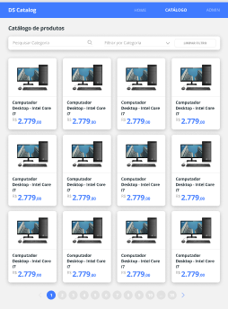

<div align="center" id="top"> 
  

&#xa0;

  <!-- <a href="https://catalog.netlify.app">Demo</a> -->

<h1 align="center">Catalog</h1>

<!-- Status -->

 <h4 align="center">
	🚧  Catalog 🚀 Under construction...  🚧
 </h4>

<hr>

<p align="center">
  

  

  

  

  

  

  
</p>

<p align="center">
  <a href="#dart-about">About</a> &#xa0; | &#xa0; 
  <a href="#sparkles-features">Features</a> &#xa0; | &#xa0;
  <a href="#rocket-technologies">Technologies</a> &#xa0; | &#xa0;
  <a href="#white_check_mark-requirements">Requirements</a> &#xa0; | &#xa0;
  <a href="#checkered_flag-starting">Starting</a> &#xa0; | &#xa0;
  <a href="#books-references">References</a> &#xa0; | &#xa0;
  <a href="#memo-license">License</a> &#xa0; | &#xa0;
  <a href="https://github.com/jocile" target="_blank">Author</a>
</p>

<br>

</div>

## :dart: About

Product catalog system using spring boot as backend and react as frontend, which is developed in [DevSuperior](https://devsuperior.com.br/) course bootcamp.

## :sparkles: Features

- Product catalog screen with pagination;
- Product detail screen;
- Interface for listing, inserting, editing and deleting records.
- Security with data validation, authentication and authorization access;
- CRUD Database access for products, categories and users;
- Automated tests;
- Cloud Services Platforms;

## :rocket: Technologies

The following tools were used in this project:

- [Java JDK 17](https://docs.oracle.com/en/java/javase/17/);
  - [Lombok to generate class constructors, with getters and setters](https://projectlombok.org/);
  - [Maven builder](https://maven.apache.org/);
  - [Spring Boot framework](https://glysns.gitbook.io/springframework/);
    - [Spring Data JPA](https://docs.spring.io/spring-boot/docs/2.5.6/reference/htmlsingle/#boot-features-jpa-and-spring-data);
  - [Swagger implementing springdoc-openapi](https://springdoc.org/);
- [H2 in-memory database](https://www.h2database.com/);
- [Postgresql 12 database](https://www.postgresql.org/about/news/postgresql-12-released-1976/);
  - [PgAdmin database administration platform](https://www.pgadmin.org/);
- [ReactJS user interfaces](https://pt-br.reactjs.org/);
  - [Yarn - package management](https://yarnpkg.com/);
  - [React Native](https://reactnative.dev/);
  - [TypeScript](https://www.typescriptlang.org/);
  - [Bootstrap web framework](https://getbootstrap.com/);
- [Netlify web app server](https://www.netlify.com/);
- [Heroku - plataform as a service](https://www.heroku.com/);
- [AWS CLI](https://docs.aws.amazon.com/cli/latest/userguide/cli-chap-welcome.html);

## :white_check_mark: Requirements

<!-- Before starting :checkered_flag:, you need to have [Git](https://git-scm.com), [yarn](https://yarnpkg.com/)-->

Before starting :checkered_flag:, you need to have [Java JDK 17](https://www.oracle.com/java/technologies/downloads/#java17), [Git](https://git-scm.com) and [Maven](https://maven.apache.org/install.html) installed.

## :checkered_flag: Starting

> Clone this project

```bash
git clone https://github.com/jocile/catalog
```

> Access

```bash
cd catalog/backend
```

> Run the project backend

```bash
./mvnw spring-boot:run
```

> The backend API will initialize in the browser\
> <http://localhost:8080/swagger-ui/index.html>

> 🚧 The frontkend is 🚀 Under construction... 🚧

<!--
> Access
```bash
$ cd catalog/frontend
```
> Install dependencies
```bash
$ yarn
```
> Run the project frontend
```bash
$ yarn start
```

> The local frontend server will initialize in the browser: <http://localhost:3000>\
> and Dashboard URL route will be initialized in: <http://localhost:3000/dashboard>

```bash
# Access the backend server with the following
$ cd ../backend

# Run the backend interface with
$ ./mvnw spring-boot:run
```

> The local backend server will initialize in the browser: <http://localhost:8080/swagger-ui/index.html>\
> and in-memory database H2 will be initialized in <http://localhost:8080/h2-console>
-->

## :books: References

- :books: [See the documentation on wiki](https://github.com/jocile/catalog/wiki)
- :file_folder: [App diagrams](docs/diagrams/);
- :link: [Bootcamp Documentation SDS 5 pt-BR](https://github.com/devsuperior/sds5);
- :link: [Official Apache Maven documentation](https://maven.apache.org/guides/index.html);
- :link: [Spring Boot Maven Plugin Reference Guide](https://docs.spring.io/spring-boot/docs/2.4.12/maven-plugin/reference/htmlsingle/);
- :link: [Create an OCI image](https://docs.spring.io/spring-boot/docs/2.4.12/maven-plugin/reference/html/#build-image);
- :link: [Spring Web](https://docs.spring.io/spring-boot/docs/2.5.6/reference/htmlsingle/#features.developing-web-applications);
  - :link: [Building a RESTful Web Service](https://spring.io/guides/gs/rest-service/);
  - :link: [Serving Web Content with Spring MVC](https://spring.io/guides/gs/serving-web-content/);
- :link: [Spring Data JPA](https://docs.spring.io/spring-boot/docs/2.5.6/reference/htmlsingle/#features.sql.jpa-and-spring-data);
  - :link: [Accessing Data with JPA](https://spring.io/guides/gs/accessing-data-jpa/);
- :link: [Spring Security](https://docs.spring.io/spring-boot/docs/2.7.0/reference/htmlsingle/#web.security);
  - :link: [Securing a Web Application](https://spring.io/guides/gs/securing-web/);
  - :link: [Enabling Cross Origin Requests for a RESTful Web Service](https://spring.io/blog/2022/02/21/spring-security-without-the-websecurityconfigureradapter)
  - :link: [Spring Boot and OAuth2](https://spring.io/guides/tutorials/spring-boot-oauth2/);
  - :link: [Authenticating a User with LDAP](https://spring.io/guides/gs/authenticating-ldap/);
- :link: [Tutorial: Intro to React](https://reactjs.org/tutorial/tutorial.html);
  - :link: [React Bootstrap](https://react-bootstrap.github.io/);
  - :link: [Upgrading React Router](https://reactrouter.com/docs/en/v6/upgrading/reach);
  - :link: [Styled components in React](https://styled-components.com/docs/basics);
- :link: [TypeScript Documentation](https://www.typescriptlang.org/docs/);

## :memo: License

This project is under license from MIT. For more details, see the [LICENSE](LICENSE.md) file.

Made with :heart: by <a href="https://github.com/jocile" target="_blank">Jocile</a>

&#xa0;

<a href="#top">Back to top</a>
