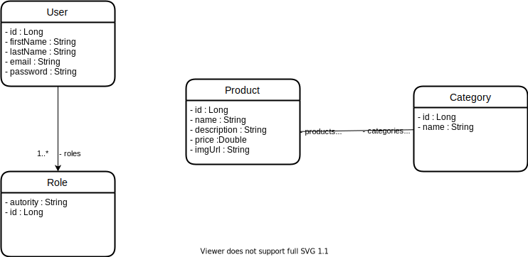

# Diagrams

## Class diagram

```mermaid
classDiagram
    class Category{
        <<entity>>
        @Data
        @AllArgsConstructor
        @NoArgsConstructor
        - id : Long
        - name : String
        - createdAt : Instant
        - updatedAt : Instant
        prePersist() void
        preUpdate() void
    }
    class CategoryRepository{
        <<repository-interface>>
    }
    class CategoryResource{
        <<controller>>
        - service : CategoryService
        findAll() ResponseEntityPage~CategoryDTO~
        findById(id) ResponseEntity~CategoryDTO~
        insert(dto) ResponseEntity~CategoryDTO~
        update(dto) ResponseEntity~CategoryDTO~
        delete(id) ResponseEntity~void~
    }
    class CategoryService{
        <<service>>
        - repository : CategoryRepository
        findAll() List~CategoryDTO~
        findAllPaged(pageable) Page~CategoryDTO~
        findById(id) ResponseEntity~CategoryDTO~
        insert(dto) ResponseEntity~CategoryDTO~
        update(dto) ResponseEntity~CategoryDTO~
        delete(id) ResponseEntity~void~
    }
    class CategoryDTO{
        <<dto>>
        @Getter
        @Setter
        @AllArgsConstructor
        @NoArgsConstructor
        - id : Long
        - name : String
    }
    class EntityNotFoundException{
      <<RuntimeException>>
    }
    class StandardError{
      @NoArgsConstructor
      @Getter
      @Setter
      - timestamp : Instant
      - status : Integer
      - error : String
      - message : String
      - path : String
    }
    CategoryDTO *-- Category
    CategoryService *-- Category
    CategoryService *-- CategoryDTO
    CategoryService *-- CategoryRepository    
    CategoryResource *-- CategoryDTO
    CategoryResource *-- CategoryService
    CategoryResource *-- EntityNotFoundException
    CategoryResource *-- StandardError
  ```
## ER diagram

```mermaid
erDiagram
    USER ||--|{ ROLE : contains
    PRODUCT O|--|{ CATEGORY : contains
    USER {
      Long id PK
      String firstName
      String lastName
      String email
      String password
    }
    ROLE {
      String autority
      Long id PK
    }
    PRODUCT {
      Long id PK
      String name
      String description
      Double price
      String imgUrl
    }
    CATEGORY {
        Long id PK
        String name
    }
```

| Value (left) |	Value (right) |	Meaning |
| :------: | :------: | --- |
| \|o | o\| | 	Zero or one |
| \|\|| \|\||	Exactly one |
| }o	| o{	|  Zero or more (no upper limit) |
| }\|	| \|{ |	One or more (no upper limit) |



## References

:link: [Diagrams wiki](https://github.com/jocile/catalog/wiki/Diagrams)\
:memo: [Mermaid diagrams](https://mermaid-js.github.io/)\
:chart_with_upwards_trend: [Diagrams online editor](https://mermaid-js.github.io/mermaid-live-editor/edit#pako:eNpVkM1qw0AMhF9F6NRC_AI-FBo7zSXQQHLz-iC8cnZJ9oe1TAm2373rmkKrk9B8MwyasAuascRbomjgWisPed6byiQ7iKOhhaJ4m48s4ILn5wz7l2OAwYQYrb-9bvx-haCaTivGIMb6-7JJ1Y__0_MMdXOiKCG2f5XrV5jh0NizyfH_FZM4uz6ansqeio4SVJRa3KHj5MjqXHtaDQrFsGOFZV419zQ-RKHyS0bHqEn4oK2EhDnmMfAOaZRwefoOS0kj_0K1pfwFtx2XbzAdW4g)
